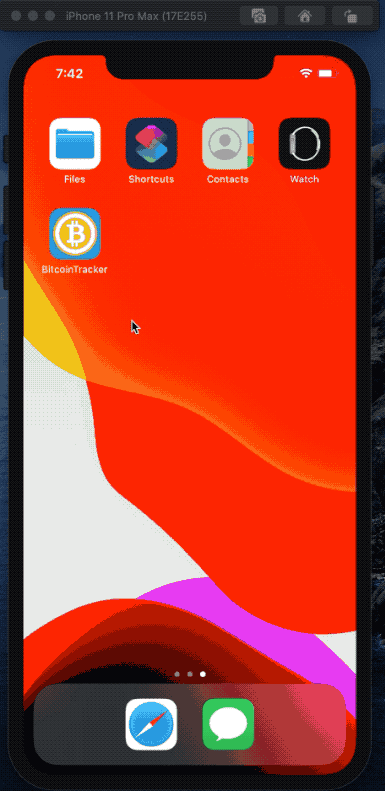

# Byte Coin
## Overview
Track bitcoin rate in your favorite currency.

## Screenshots


## Requirements
* macOS
* Xcode 11
* iDevice running iOS 13

## Local Setup
* Git clone / download repo.
* Navigate to project folder and double click on ByteCoin.xcodeproj to open project in Xcode.
* Get your API key from [CoinAPI.io](https://www.coinapi.io/)
* Navigate to Model in project explorer open CoinMnager.swift in code editor.
* Paste your API key where it says ```let apiKey = "YOUR_API_KEY_HERE"```.
* Run the application in simulator or on your iOS device.

## Built With
* Swift 5
* Xcode 11
* [CoinAPI.io](https://www.coinapi.io/) - Bitcoin data and exchange rates.
